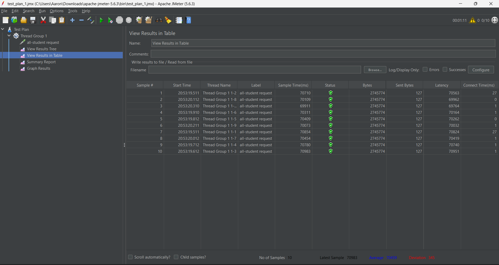
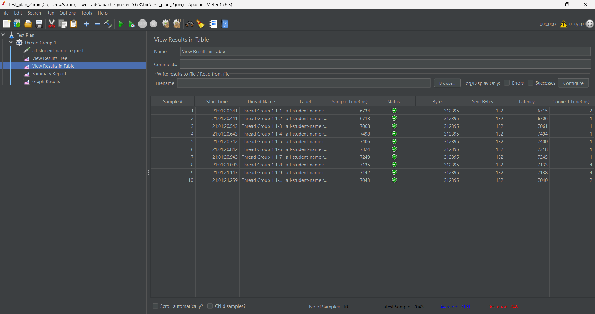
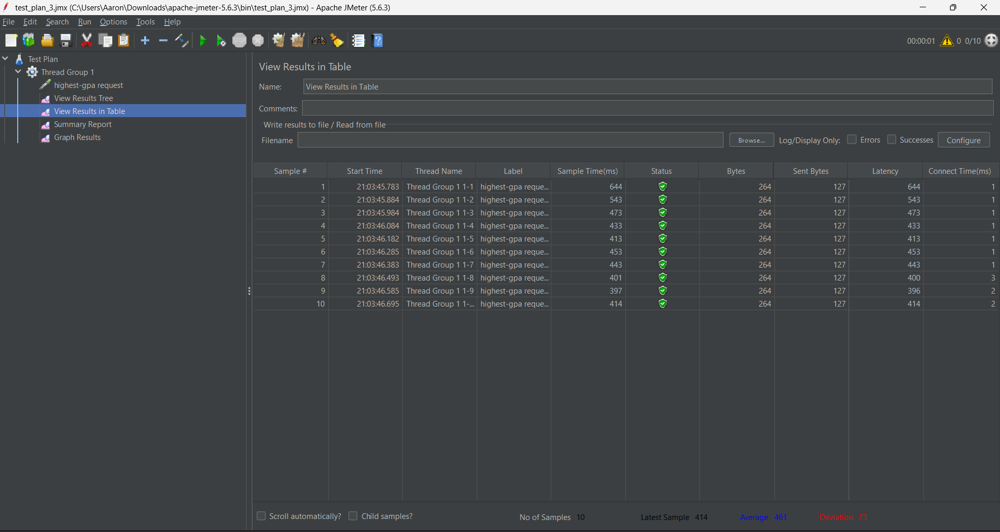
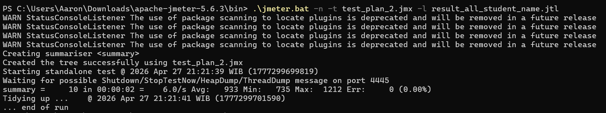
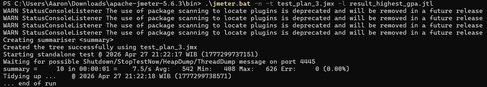
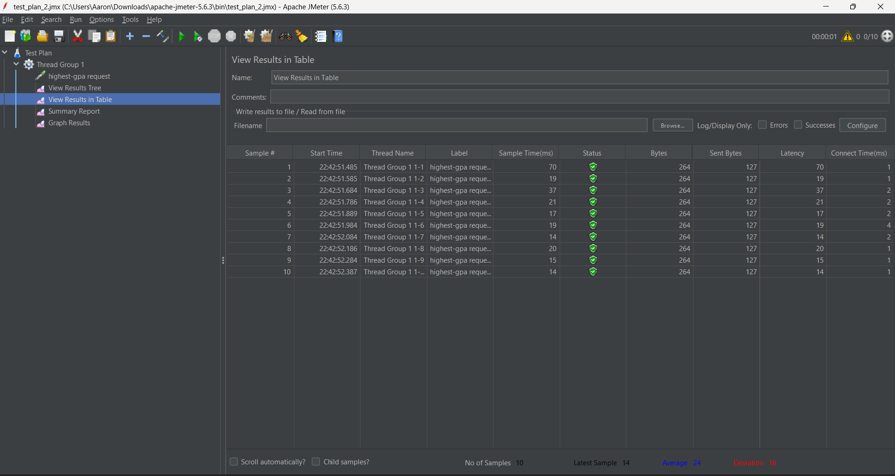

Hasil Performance Testing JMeter

1. Endpoint /all-student

2. Endpoint /all-student-name

3. Endpoint /highest-gpa

Hasil Performance Testing JMeter (CLI / Non-GUI)

1. Eksekusi /all-student-name

2. Eksekusi /highest-gpa

Performance Profiling and Optimization Report

Hasil Performance Testing JMeter (After Optimization)

1. Eksekusi /all-student (test_plan_1)
   

2. Eksekusi /all-student-name (test_plan_2)
   

3. Eksekusi /highest-gpa (test_plan_3)
   

Kesimpulan

Sebelum optimasi, all student average nya 70.459 ms, setelah optimasi menjadi 24.476 ms (Peningkatan 65,26%). Hal ini dikarenakan masalah N+1 Query yang telah diperbaiki dengan memanggil repository secara langsung (menghindari looping query).

Untuk endpoint all-student-name, rata-rata waktu respon turun dari 7.131 ms menjadi 494 ms (Peningkatan 93,07%) berkat penggunaan `StringBuilder` yang menggantikan konkatenasi string manual (`+=`) yang berat bagi memori.

Sedangkan pada endpoint highest-gpa, terjadi peningkatan signifikan dari 461 ms menjadi hanya 24 ms (Peningkatan 94,79%) karena proses pencarian nilai maksimal didelegasikan langsung ke tingkat database melalui query JPA `findFirstByOrderByGpaDesc()`, sehingga aplikasi tidak perlu menarik seluruh data ke memori.

REFLECTION

1. What is the difference between the approach of performance testing with JMeter and profiling with IntelliJ Profiler in the context of optimizing application performance?
   Pendekatan JMeter lebih berfokus pada black-box testing dari sisi eksternal. JMeter mensimulasikan kondisi real-world di mana banyak user menembak endpoint secara bersamaan untuk melihat performa aplikasi secara keseluruhan (mengukur response time dan throughput). Sebaliknya, IntelliJ Profiler menggunakan pendekatan white-box dari dalam aplikasi. Profiler membedah JVM untuk melihat secara spesifik method mana yang mengonsumsi CPU time atau memori paling besar. Singkatnya, JMeter memberi tahu kita seberapa lambat aplikasinya dari kacamata user, sedangkan Profiler memberi tahu tepat di baris kode mana masalah lambat tersebut berasal.

2. How does the profiling process help you in identifying and understanding the weak points in your application?
   Profiling membantu dengan cara merekam dan memvisualisasikan eksekusi kode, misalnya melalui fitur Method List atau Flame Graph. Alih-alih menebak bagian kode mana yang bermasalah, saya bisa melihat secara empiris method mana yang memonopoli waktu komputasi. Contohnya, dari hasil profiling, saya bisa langsung mengidentifikasi bahwa proses iterasi manual untuk mencari IPK tertinggi atau penggunaan konkatenasi string biasa (+=) adalah titik lemah yang menyebabkan aplikasi bekerja terlalu keras.

3. Do you think IntelliJ Profiler is effective in assisting you to analyze and identify bottlenecks in your application code?
   Ya, sangat efektif. Keunggulan utamanya adalah integrasinya yang menyatu dengan IDE. Saat saya menemukan method dengan waktu eksekusi yang tidak wajar pada hasil rekaman, saya bisa langsung melakukan Jump to Source untuk melompat tepat ke baris kode penyebab bottleneck tersebut. Ini membuat siklus menemukan masalah dan memperbaikinya menjadi sangat cepat dan terarah.

4. What are the main challenges you face when conducting performance testing and profiling, and how do you overcome these challenges?
   Tantangan utamanya adalah efek warm-up dari JIT Compiler bawaan JVM. Pada saat aplikasi baru dijalankan, response time awal sering kali sangat tinggi dan hasil profiling menjadi bias atau tidak merepresentasikan performa asli. Cara saya mengatasinya adalah dengan mengeksekusi endpoint beberapa kali terlebih dahulu, atau membuang hasil run yang pertama, lalu baru mengumpulkan data dari run kedua dan seterusnya ketika kondisi aplikasi sudah stabil dan kode telah dioptimasi secara runtime oleh Java.

5. What are the main benefits you gain from using IntelliJ Profiler for profiling your application code?
   Manfaat utama yang saya rasakan adalah kemampuannya untuk melacak sumber kelambatan aplikasi secara pasti tanpa harus menebak-nebak. Melalui tab Method List di Profiler, saya bisa melihat rincian waktu eksekusi (CPU time) untuk setiap method. Hal ini sangat penting karena saya jadi tahu persis di fungsi mana aplikasi menghabiskan waktu komputasi paling banyak (misalnya saat terjadi N+1 query). Dengan insight tersebut, proses refactoring menjadi sangat terarah langsung ke baris kode yang memang bermasalah.

6. How do you handle situations where the results from profiling with IntelliJ Profiler are not entirely consistent with findings from performance testing using JMeter?
   Saya menyadari bahwa ketidakkonsistenan ini wajar karena keduanya mengukur parameter yang berbeda. Profiler hanya menghitung waktu pemrosesan internal (logic kode di JVM), sedangkan JMeter mengukur waktu end-to-end yang mencakup proses di luar logic, seperti serialisasi JSON dan transfer rate jaringan. Jika Profiler menunjukkan logic sudah berjalan cepat (hitungan milidetik) tetapi JMeter masih mencatat waktu yang lama (hitungan detik), saya akan mengevaluasi payload data yang dikirim. Misalnya, jika endpoint mengembalikan data sebesar 2,7 MB, waktu tambahan di JMeter sangat mungkin disebabkan oleh lamanya proses serialisasi teks dan overhead transfer jaringan, bukan karena kode Java yang lambat.

7. What strategies do you implement in optimizing application code after analyzing results from performance testing and profiling? How do you ensure the changes you make do not affect the application's functionality?
   Strategi utama saya berfokus pada efisiensi kerja. Pertama, mendelegasikan pemrosesan data berat ke database (seperti memakai query method spesifik ketimbang menarik semua data ke memori). Kedua, menghindari N+1 Query problem dengan pemanggilan data yang tepat. Ketiga, menggunakan objek yang efisien seperti StringBuilder untuk manipulasi teks skala besar. Untuk memastikan tidak merusak fungsionalitas, saya menjaga agar output (format respons dan payload JSON) yang dihasilkan tetap identik 100% antara sebelum dan sesudah refactoring. Ke depannya, hal ini juga bisa dipastikan dengan menjalankan Unit Test secara berkala sehingga kita yakin optimasi hanya berimbas pada performa, bukan mengubah logic bisnis.

Hasilnya menjadi seperti ini:
Sebelum optimasi, all student average nya 70.459 ms, setelah optimasi menjadi 24.476 ms (Peningkatan 65,26%). Hal ini dikarenakan masalah N+1 Query yang telah diperbaiki dengan memanggil repository secara langsung (menghindari looping query).

Untuk endpoint all-student-name, rata-rata waktu respon turun dari 7.131 ms menjadi 494 ms (Peningkatan 93,07%) berkat penggunaan `StringBuilder` yang menggantikan konkatenasi string manual (`+=`) yang berat bagi memori.

Sedangkan pada endpoint highest-gpa, terjadi peningkatan signifikan dari 461 ms menjadi hanya 24 ms (Peningkatan 94,79%) karena proses pencarian nilai maksimal didelegasikan langsung ke tingkat database melalui query JPA `findFirstByOrderByGpaDesc()`, sehingga aplikasi tidak perlu menarik seluruh data ke memori.

